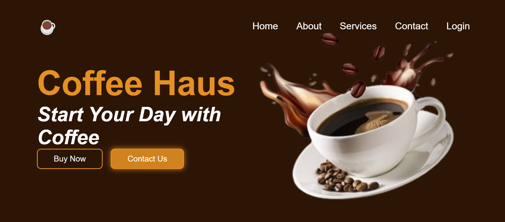

# coffee-Haus
This is a basic landing page for a coffee shop  **Coffee Haus**.  
It’s built entirely with **HTML and CSS**, without using any JavaScript or frameworks.
Coffee Haus is a simple web design project that focuses on layout, typography, color, and image presentation. It was created as part of my practice to improve my frontend web development skills using only HTML and CSS.

